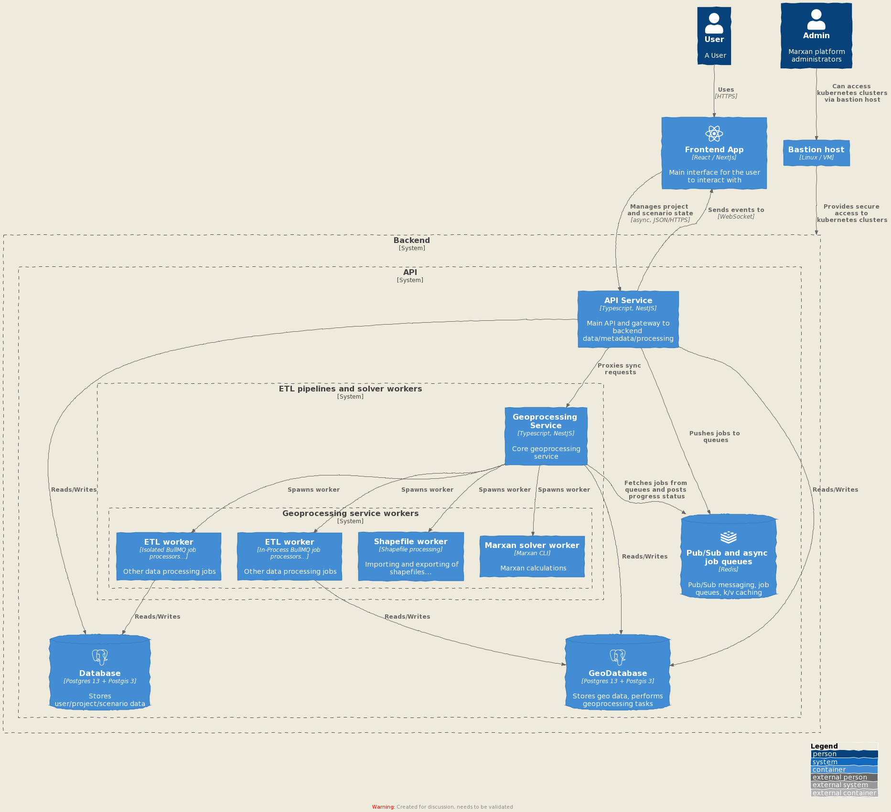

# Marxan Cloud platform

Welcome to the Marxan Cloud platform. We aim to bring to the planet the finest
workflows for conservation planning.

## Quick start

This repository is a monorepo which includes all the microservices of the Marxan
Cloud platform. Each microservice lives in a top-level folder.

Services are packaged as Docker images.

Microservices are set up to be run with or without Docker Compose for local 
development - see the sections below for more details.

In CI, testing, staging and production environments, microservices are
orchestrated via Kubernetes (forthcoming).

## Platform architecture

See [ARCHITECTURE_infrastructure.md](./docs/ARCHITECTURE_infrastructure.md) for
details.



## Dependencies

- [Nodejs](https://nodejs.org/en/) v14.18
- [Yarn](https://yarnpkg.com/)
- [PostgreSQL](https://www.postgresql.org/) v14
- [Postgis](https://postgis.net/) v3
- [Redis](https://redis.io/) v6

## Running API and Geoprocessing services using Docker

1. Install Docker (19.03+):
	* [MacOS](https://docs.docker.com/docker-for-mac/)
	* [GNU/Linux](https://docs.docker.com/install/linux/docker-ce/ubuntu/)
2. Install [Docker Compose](https://docs.docker.com/compose/install/)
3. Create an `.env` at the root of the repository, defining all the required
   [environment variables](./ENV_VARS.md). In most cases, for variables other
   than secrets, the defaults in `env.default` may just work - your mileage may vary.

The PostgreSQL credentials are used to create a database user when the
PostgreSQL container is started for the first time. PostgreSQL data is persisted
via a Docker volume.

### Running the Marxan Cloud platform

Run `make start` to start all the services.

Run `make start-api` to start api services.

### Running the notebooks

Run `make notebooks` to start the jupyterlab service.

### Seed data

To seed the geodb database after a clean state, please follow the steps below:

``` bash
make seed-geodb-data
```

This will populate the metadata DB and will trigger the geo-pipelines to seed
the geoDB.

Note: Full db set up will require at least 16GB of RAM and 40GB of disk space in
order to carry out some of these tasks (GADM and WDPA data import pipelines).
Also, the number of CPU cores will impact the time needed to seed a new instance
with the complete GADM and WDPA datasets.

To populate a new instance with a small subset of test data, instead:

``` bash
make seed-dbs
```

We also provide a way to reset db instances from scratch. This can be useful to
do regularly, to avoid keeping obsolete data in the local development instance.

``` bash
make clean-slate
```

And finally, we provide a set of commands to create new dbs dumps from upstream
data sources, upload these dunps to an Azure storage bucket, and populate both
dbs from these dumps. This will typically be faster than triggering the full
geodb ETL pipelines.

``` bash
make generate-content-dumps && make upload-dump-data
```

``` bash
make restore-dumps
```

## Running API and Geoprocessing services natively

Make sure you have installed and configured all the [dependencies](#Dependencies) 
locally. PostgreSQL (with PostGIS) and Redis need to be up and running.

When running the API and Geoprocessing services without relying on Docker
Compose for container orchestration, be sure to review and set the correct
[environment variables](./ENV_VARS.md) before executing the application. 
The `env.default` file and the `docker-compose` configuration files may give
you some example values that work for docker-based executions, and that may
be useful when implementing your native execution configuration.

The included Makefile has some useful build targets (commands) specifically
targeted at native execution (prefixed with `native-`) that you'll find helpful.
Refer to the Makefile inline documentation for more details.

### Setting up test seed data

``` bash
make native-seed-api-with-test-data
```

### Running the API/Geoprocessing

You can find the source code for the API/Geoprocessing applications inside the
`api` folder.

Be sure to install the necessary `nodejs` dependencies using `yarn` prior to
running the applications

To start the API, run:

``` bash
yarn start
```

To start the Geoprocessing application, run:

``` bash
yarn start geoprocessing
```

### Running tests

Running the whole test suite requires running 3 commands, each focused on a
specific type of test:

To run the unit tests for both the API and the Geoprocessing app:
``` bash
yarn run test
```

To run the E2E tests for the API:
``` bash
yarn run api:test:e2e
```

To run the E2E tests for the Geoprocessing app:

``` bash
yarn run geoprocessing:test:e2e
```

Note that E2E tests may trigger cross-application requests, so:
- When running E2E tests for the API, you must have the Geoprocessing
  application running in the background.
- When running E2E tests for the Geoprocessing application, you must have the
  API running in the background.

Running tests require previously loading the [test seed
data](#setting-up-test-seed-data), and may modify data in the database - do not
run tests using a database whose data you don't want to lose.

## Development workflow (TBD)

We use a lightweight git flow workflow. `develop`, `main`, feature/bug fix
branches, release branches (`release/vX.Y.Z-etc`).

Please use per component+task feature branches: `<feature
type>/<component>/NNNN-brief-description`. For example:
`feature/api/12345-helm-setup`.

PRs should be rebased on `develop`.

As feature types:

* `feature`
* `bugfix` (regular bug fix)
* `hotfix` (urgent bug fixes fast-tracked to `main`)

## Devops

### CI/CD

[CI/CD](https://www.redhat.com/en/topics/devops/what-is-ci-cd) is handled with 
[GitHub Actions](https://github.com/features/actions). More details can be found 
by reviewing the actual content of the `.github/workflows` folder but, in a nutshell, 
GitHub Action will automatically run tests on code pushed as part of a Pull Request.

For code merged to key branches (currently `main` and `develop`), once tests run
successfully, [Docker](https://www.docker.com/) images are built and pushed to a 
private [Azure Container Registry](https://azure.microsoft.com/en-us/services/container-registry/).

The GitHub Actions workflows currently configured requires a few [secrets](https://docs.github.com/en/actions/security-guides/encrypted-secrets)
to be set on GitHub in order to work properly:

- `AZURE_CLIENT_ID`: Obtain from Terraform's `azure_client_id` output
- `AZURE_TENANT_ID`: Obtain from Terraform's `azure_tenant_id` output
- `AZURE_SUBSCRIPTION_ID`: Obtain from Terraform's `azure_subscription_id` output
- `REGISTRY_LOGIN_SERVER`: Obtain from Terraform's `azurerm_container_registry_login_server` output
- `REGISTRY_USERNAME`: Obtain from Terraform's `azure_client_id` output
- `REGISTRY_PASSWORD`: Obtain from Terraform's `azuread_application_password` output

Some of these values are obtained from Terraform output values, which will be documented
in more detail in the [Infrastructure](#infrastructure) docs.


### Infrastructure

Infrastructure code and documentation can be found under `/infrastructure`

## Bugs

Please use the [Marxan Cloud issue
tracker](https://github.com/Vizzuality/marxan-cloud/issues) to report bugs.

## License

(C) Copyright 2020-2022 Vizzuality.

This program is free software: you can redistribute it and/or modify it under
the terms of the [MIT License](LICENSE) as included in this repository.

This program is distributed in the hope that it will be useful, but WITHOUT ANY
WARRANTY; without even the implied warranty of MERCHANTABILITY or FITNESS FOR A
PARTICULAR PURPOSE.  See the [MIT License](LICENSE) for more details.

You should have received a copy of the MIT License along with this program.  If
not, see https://spdx.org/licenses/MIT.html.
