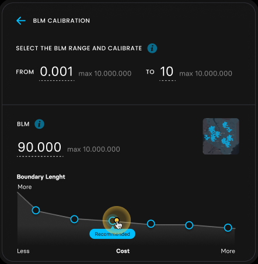

# BLM calibration preview maps - Brief

Once a user has run a BLM calibration for a scenario, they should see the
results of the calibration, which includes one small map for each of the BLM
values used in the calibration, showing the spatial connectedness/clumping of
the planning units selected for protection (see [main Brief
document](../brief.md)).

Pending in-progress design updates, the illustration below should give a sense
of the kind of maps that will be displayed to users.

Each of these images is generated at the end of the relevant BLM calibration
run, via the platform's Webshot service, and stored alongside the numeric
results of the BLM calibration run.