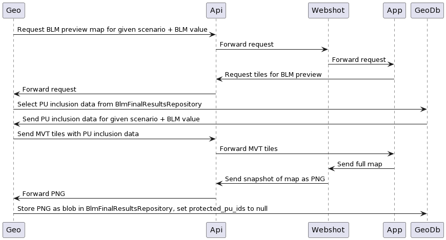

# BLM calibration preview maps - High-level design

Preview maps are essentially a visual representation of the scenario's planning
units that are selected for protection in the best solution of a given BLM run.

## Overview: generating and retrieving maps

### Generating maps

When generating preview maps, the _inputs_ are:

- the list of ids of the planning units selected for protection (from backend)
- the geometries of the planning units of the project (from backend)
- the relevant basemap layer(s) (from app)
- map layout, styles, etc. (from app)

The expected _output_ is a PNG file created by pointing a dedicated module of
the Webshot service to a frontend app "page" where a map of the scenario is
rendered, with the planning units selected for protection highlighted in the
relevant way as per frontend styles.

This PNG file data is persisted as part of the database records that hold
results of BLM calibrations for a given scenario.

### Retrieving maps

Whenever a user navigates to the BLM calibration tab of the frontend app, if a
BLM calibration has been run at least once, a preview map is displayed for eah
BLM value used in the calibration, by requesting it to an API endpoint that
retrieves the PNG data stored during through the process outlined in the
previous section.

## Generating maps

### Workflow overview

Once *each* calibration run has ended, the UUIDs of all planning units selected
for protection should be stored alongside the BLM run results already persisted
(cost, boundary length). See _Preparing inputs/Planning units selected for
protection_ section below for details.

Once *all* the calibration runs have finished and their workspace have been
cleaned up, snapshot maps should be requested via the snapshot service, and
eventually stored in the `BlmFinalResultsRepository` for each BLM value in the
calibration session, replacing the list of ids of planning units selected for
protection in the previous step.



```
@startuml
Geo -> Webshot: Request BLM preview map for given scenario + BLM value
Webshot -> App: Forward request
App -> Api: Request MVT tiles for BLM preview (new endpoint for tiles)
Api -> Geo: Forward request
Geo -> GeoDb: Select PU inclusion data from BlmFinalResultsRepository
GeoDb -> Geo: Send PU inclusion data for given scenario + BLM value
Geo -> Api: Send MVT tiles with PU inclusion data
Api -> App: Forward MVT tiles
App -> Webshot: Send full map
Webshot -> Geo: Send snapshot of map as PNG
Geo -> GeoDb: Store PNG as blob in BlmFinalResultsRepository, set protected_pu_ids to null
@enduml
```

Requests from the Geoprocessing service to the Webshot service are handled
through the `@marxan/webshot` shared library.

### Authentication: Webshot to frontend app

The webshot service needs to access frontend app content that is not only
restricted to authenticated users, but also relies on the identity of the user
who performs the BLM calibration request to be passed on to the API (when
requesting MVT tiles: see diagram above) so that authorization for these tiles
can be properly handled.

In order to enable all these steps of the authenticated workflow, the frontend
app will include a current Next Auth token for the current user in the `Cookie`
header of the `POST` request through which a calibration request is sent. API
clients other than the app will likewise need to somehow grab such token from
the instance of the app they would like to obtain snapshot from at the end of
the BLM calibration process, and supply this as a `next-auth.session-token`
cookie in the `POST` request for the calibration.

### Preparing inputs

#### Planning units selected for protection

This data can be gathered directly from the `output/output_best.csv` file from
the run's workspace. This is a set of `[puid,included]` pairs, for each of the
planning units in the scenario.

The `puid` is the numeric id (`(geodb)projects_pu.puid`), which will need
to be joined to the `id` (UUID) of the planning unit as this is what is used to
in vector tiles.

This data should be persisted in a new column of the
`(geodb)blm_partial_results` table (`protected_pu_ids uuid[]`) via a
post-processing step in `BlmPartialResultsRepository.savePartialResult()`,
gathering the relevant data from `output_best.csv` similarly to how
`BlmBestRunService.getBlmCalibrationBestRun()` gathers summary data (such as
cost and boundary length) from `output_sum.csv`.

This column will be populated with an array of UUIDs of all the planning units
that have been selected for protection in the given BLM calibration run.

Once all the calibration runs have finished, the PU selection data should be
moved to a new corresponding column in `(geodb)blm_final_results` alongside all
the other data moved over through
`BlmFinalResultsRepository.saveFinalResults()`.

Throughout the new steps above added to the post-processing phase of BLM
calibrations, new calls to `interruptIfKilled()` should be added, in order to
allow possible requests to interrupt the BLM calibration process to be handled,
for example, before and after requesting a PNG snapshot for each BLM value.

#### Geometries of the planning units of the project

These are available via `(geodb)scenarios_pu_data` (via a join with
`(geodb)planning_units_geom`) and the relevant tiles are available to API
consumers (for the task at hand, the frontend app) via the API's tiles
endpoints.

For BLM preview maps, the app needs tiles that include planning unit geometries
and a property for each planning unit indicating whether the unit is included in
the solution for a given BLM value.

This is similar to the conditional inclusion of data such as `results` (`GET
/api/v1/scenarios/:id/planning-units/tiles/:z/:x/:y.mvt?include=results`, where
each planning unit geometry carries data on its selection frequency as gathered
by the number of iterations of the Marxan run in which the unit has been
selected for protection).

Data for each planning unit is here fetched from the array if ids of planning
units selected for protection in each BLM calibration run's best solution, as
stored in `(geodb)blm_final_results` while preparing data of planning units
selected for protection (see previous step).

These tiles should be exposed via a new endpoint: `GET
/api/v1/scenarios/:scenarioId/calibration/tiles/:blmValue/:z/:x/:y.mvt`.

This endpoint should be accessible to users who can view BLM calibration results
for the relevant scenario (see main permissions matrix for details).

## Retrieving preview maps

A new endpoint (`GET
/api/v1/scenarios/:scenarioId/calibration/maps/preview/:blmValue`) serves the
PNG preview maps for a given scenario and BLM value.

As BLM values will typically vary between BLM calibration attempts, the list of
valid BLM values for which PNG images are available at any given time should be
retrieved by first using the `GET /api/v1/scenarios/:scenarioId/calibration` to
list all the available results, and then requesting preview maps via the new
endpoint for PNG maps.

This endpoint should be accessible to users who can view BLM calibration results
for the relevant scenario (see main permissions matrix for details).
