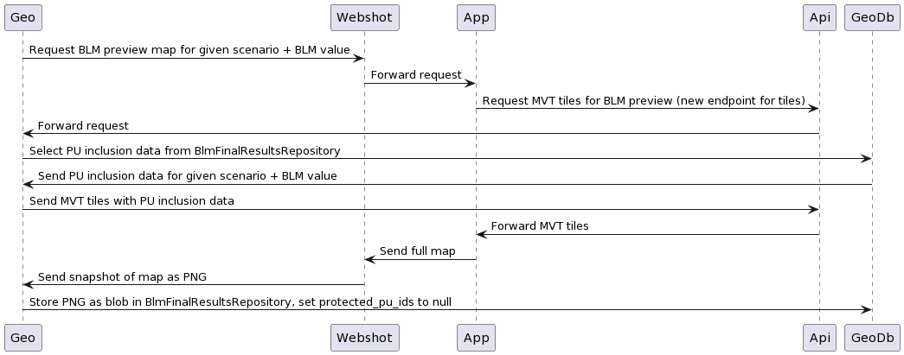

# BLM calibration preview maps - High-level design

Preview maps are essentially a visual representation of the scenario's planning
units that are selected for protection in the best solution of a given BLM run.

For this, the _inputs_ are:

- the list of ids of the planning units selected for protection (from backend)
- the geometries of the planning units of the project (from backend)
- the relevant basemap layer(s) (from app)
- map layout, styles, etc. (from app)

The expected _output_ is a PNG file created by pointing a dedicated module of
the Webshot service to a frontend app "page" where a map of the scenario is
rendered, with the planning units selected for protection highlighted in the
relevant way as per frontend styles.

## Workflow overview

Once *each* calibration run has ended, the UUIDs of all planning units selected
for protection should be stored alongside the BLM run results already persisted
(cost, boundary length). See _Preparing inputs/Planning units selected for
protection_ section below for details.

Once *all* the calibration runs have finished and their workspace have been
cleaned up, snapshot maps should be requested via the snapshot service, and
eventually stored in the `BlmFinalResultsRepository` for each BLM value in the
calibration session, replacing the list of ids of planning units selected for
protection in the previous step.



```
@startuml
Geo -> Api: Request BLM preview map for given scenario + BLM value
Api -> Webshot: Forward request
Webshot -> App: Forward request
App -> Api: Request tiles for BLM preview
Api -> Geo: Forward request
Geo -> GeoDb: Select PU inclusion data from BlmFinalResultsRepository
GeoDb -> Geo: Send PU inclusion data for given scenario + BLM value
Geo -> Api: Send MVT tiles with PU inclusion data
Api -> App: Forward MVT tiles
App -> Webshot: Send full map
Webshot -> Api: Send snapshot of map as PNG
Api -> Geo: Forward PNG
Geo -> GeoDb: Store PNG as blob in BlmFinalResultsRepository, set protected_pu_ids to null
@enduml
```

Requests from the Geoprocessing service to the API service should be protected
via `x-api-key` authentication (similarly to what is done in the Geoprocessing
service's `ApiEventsService` in order to dispatch API events to the API's own
API events module).

#### To be decided

How to handle authentication to the frontend from the webshot service.

This could be done (as already done for PDF summary reports of scenario
solutions) via a fresh frontend authentication cookie. However, this would need
to be provided _alongside the request to start a BLM calibration_ (as the
workflow outlined above is a post-processing step of the BLM calibration
itself).

Alternatively, a workflow involving injecting MVT data into a non-authenticated
app page (via the webshot service/Puppeteer) could be used, if technically
feasible in terms of frontend architecture.

### Preparing inputs

#### Planning units selected for protection

This data can be gathered directly from the `output/output_best.csv` file from
the run's workspace. This is a set of `[puid,included]` pairs, for each of the
planning units in the scenario.

The `puid` is the numeric id (`(geodb)projects_pu.puid`), which will need
to be joined to the `id` (UUID) of the planning unit as this is what is used to
in vector tiles.

This data should be persisted in a new column of the
`(geodb)blm_partial_results` table (`protected_pu_ids uuid[]`) via a
post-processing step in `BlmPartialResultsRepository.savePartialResult()`,
gathering the relevant data from `output_best.csv` similarly to how
`BlmBestRunService.getBlmCalibrationBestRun()` gathers summary data (such as
cost and boundary length) from `output_sum.csv`.

This column will be populated with an array of UUIDs of all the planning units
that have been selected for protection in the given BLM calibration run.

Once all the calibration runs have finished, the PU selection data should be
moved to a new corresponding column in `(geodb)blm_final_results` alongside all
the other data moved over through
`BlmFinalResultsRepository.saveFinalResults()`.

### Geometries of the planning units of the project

These are available via `(geodb)scenarios_pu_data` (via a join with
`(geodb)planning_units_geom`) and the relevant tiles are available to API
consumers (for the task at hand, the frontend app) via the API's tiles
endpoints.

For BLM preview maps, the app needs tiles that include planning unit geometries
and a flag for each planning unit indicating whether the unit is included in the
solution for a given BLM run.

This is similar to the conditional inclusion of data such as `protection`
(boolean value indicating whether a planning unit is considered protected
according to intersection with protected areas and the protection threshold
set), `lock-status` (unstated, locked in or locked out), and so on.

These tiles should be exposed via a new endpoint:
`/api/v1/scenarios/:scenarioId/calibration/tiles/preview/:blmValue/:z/:x/:y.mvt`.
