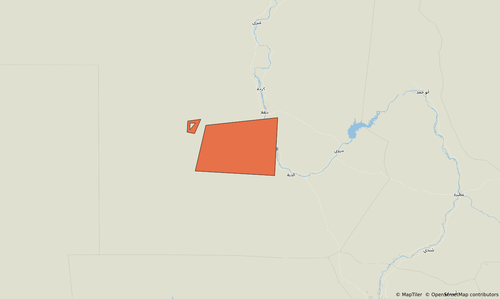

# How Marxan features are stored in backend databases

## Storage of spatial data: from-shapefile features

When features are imported from shapefile, what we actually import and persist
in `(geodb)features_data` are the individual "rows" of the uploaded shapefile,
that is, each polygon or multipolygon that is treated as a single "set of
spatial stuff" (simplifying things here, as the correct terminology has lots of
nuances which should not affect the details of what is described in this
document).

For example, if we have a feature with the two polygons as in the image below,
what we actually end up persisting in `(geodb)features_data` depends on whether
the two polygons (the small one with a hole, on the left, and the large one on
the right) are "joined" as a single "row" (when looking at the attributes table
in the source shapefile: in this case, any attributes will apply to them both as
a multipolygon "whole"; for example, they will share a common id) or if they are
two distinct "rows" (again, when looking at the related attributes table).

Let's say they are two distinct polygons/"rows". In this case, we create two
distinct `(geodb)features_data` rows. The attributes of the polygons in the
shapefile are persisted in the `(geodb)features_data.properties` column for each
of the two rows.

Given this setup, there is (in general) no such thing as a "single feature
geometry" stored in the Marxan Cloud databases, as the union of all the polygons
that make up a feature in the source shapefile.

This could still happen, as a special case of the general setup above: if a
feature's shapefile is composed of a single polygon or a single multipolygon,
then we'd extract the corresponding geometries from the source shapefile and
then persist these geometries as a single `(geodb)features_data` row.

## Calculation of amount of feature per planning unit: from-shapefile features

When we process/calculate features that were created from shapefiles (that is,
to calculate the area of the intersection between a feature and each planning
unit in a project), we do generate a union of all of a feature's geometries "on
the fly" via `st_union()` (see
`PuvsprCalculationsService.computeMarxanAmountPerPlanningUnit()`), and then
intersect this "whole feature" with each planning unit, and calculate the
intersection area as "amount" of the feature).

## Calculation of amount of feature per planning unit: legacy or from-puvspr features

In the case of features from legacy projects or features from puvspr data, all
we have in terms of spatial data for a feature is the list of PUs in which the
feature is present (where `amount > 0`): so, when importing these features, we
create one row in `(geodb)features_data` for each PU in which the feature is
present, where the geometry for the row (`the_geom` column) is an exact copy of
the geometry of the relevant planning unit (which we get from
`(geodb)planning_units_geom` via `(geodb)projects_pu`).

## Storage of spatial data: legacy and from-puvspr features

Therefore, in practice, for features from legacy projects or from puvspr data,
we create the feature's spatial data as a set of polygons, each of which matches
exactly a planning unit's polygon.

For planning grids that are uploaded by users, planning units may have different
shapes and areas, so we should not make assumptions about all of the "rows" that
make up a feature (as in `(geodb)features_data` created whe importing features
from a legacy project or from puvspr data) having the same shape/area, but what
is relevant is that for each planning unit where the feature is present, we
create an identically shaped polygon[^grid], as the "bit" of feature that
matches that planning unit. We then set its `amount` to what the user has
supplied (in a legacy project's `puvspr.dat` file for legacy imports, or in the
CSV file that users can upload to create features from puvspr data).

[^grid]: Or multipolygon - planning units can technically be multipolygons, even
though this may be uncommon in practice. See [an
example](./examples/planning-grid/planning-grid.zip) of a planning unit grid
that contains a single planning unit as a multipolygon (this is actually the
same set of geometries as for the `feature-b` example feature above).

## Changes needed for possible future support of calculation of amount at feature creation time for from-shapefile features

As final twist: if/when we support precalculating `amount` of a feature per
planning unit at feature upload time for features from shapefiles, we will also
need to adjust how we handle feature geometries.

In the case of features from legacy projects of from puvspr data, we have
feature geometries that match the planning units of the project's grid, which is
why it makes sense to attach the `amount` attribute to each of these rows:
they express exactly the amount of feature for each given planning unit.

In the case of features from shapefiles, instead, we _don't_ have feature
geometries that match planning units of the project's grid, so we'll need to
create these, likely by doing a union of all the geometries that make up a
from-shapefile feature, and then "splitting" this into rows, each of which will
match the shape of a planning unit where the feature is present: at this stage
we will be able to store precalculated amounts of a from-shapefile feature per
each planning unit.

As a corollary of the above, though, in order to keep the flow identical between
from-shapefile features on one hand and from-legacy and from-puvspr on the other
hand, we may also need to eventually create a "full/whole" feature as
polygon/multipolygon from the union of the geometries of all the "rows" of a
from-shapefile feature, and then split it into a set of `(geodb)features_data`
rows by intersecting this with the project grid.
