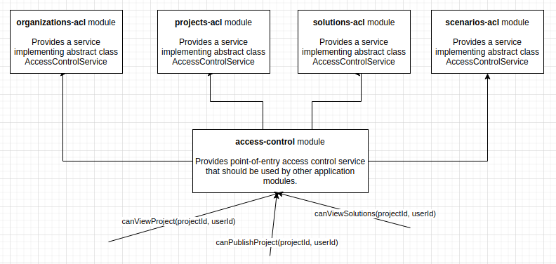

# Role base access control - High-level design

This document aims at providing an overview of the architecture of Role-based Access Control (RBAC from here on) for
the Marxan platform.

## Roles

**Platform admins** should be stored and identified separately from the remaining platform roles.

The remaining roles supported by the platform (`Owner`, `Contributor` and `Viewer`) will be stored in the `roles` 
database in the `marxan-api` database. These roles should cover the roles defined in the project requirements:

* "Platform admin" would be achieved with the implementation of a dedicated DB table for platform admins;
* "Project owner" -> role Owner for resource Project;
* "Project contributor" -> role Contributor for resource Project;
* "Project reviewer (read-only)" -> role Viewer for resource Project;
* "Project solution-viewer" -> role Viewer for resource "Solutions";

The following list describes some conventions that will be followed in the implementation of the RBAC - keep in mind
these behaviors might be overwritten by each resource, so make sure to check the **permissions matrix** for a more
comprehensive list of actions and their permissions:
* a user with role `Viewer` can read the information for the given resource (which usually includes calls to 
`GET resource` and `GET resource/:id` endpoints).
* user with role `Contributor` can perform the same actions as a `Viewer`, as well as edition actions for the given
resource (which usually includes calls to `PATCH/PUT resource/:id` endpoints).
* user with `Owner` role can perform the same actions as a `Contributor`, as well as deleting actions for the given
resource (which usually includes calls to `DELETE resource/:id` endpoints).

*Note: creation actions may be subject to more specific permissions, depending on the resource.*

**However, it is up to the functions implementing each feature (controllers, services or any other entity 
in the context of the platform) to correctly check permissions for the action being performed.** Checking permissions
should be done by calling the appropriate function in the Access Control service class for the resource being accessed.

For example, if a user with id `1` is trying to publish a `project` with id `2`, then the `publish` function
needs to check if that user can publish that project. This can be done by calling the `canPublish` function in the 
access control service in the `projects-acl` module.

## Permissions matrix

Currently, these are the roles required to perform the following actions in the platform:

| Actions / Roles                | Solution Viewer | Solution Contributor | Solution Owner | Scenario Viewer | Scenario Contributor | Scenario Owner | Project Viewer | Project Contributor | Project Owner | Organization Viewer | Organization Contributor | Organization Owner | Platform admin |
|--------------------------------|:---------------:|:--------------------:|:--------------:|:---------------:|:--------------------:|:--------------:|:--------------:|:-------------------:|:-------------:|:-------------------:|:------------------------:|:------------------:|:--------------:|
| Create organization            |                 |                      |                |                 |                      |                |                |                     |               |                     |                          |                    |        ✔️       |
| Read organization              |                 |                      |                |                 |                      |                |                |                     |               |          ✔️          |             ✔️            |          ✔️         |        ✔️       |
| Update organization            |                 |                      |                |                 |                      |                |                |                     |               |                     |             ✔️            |          ✔️         |        ✔️       |
| Delete organization            |                 |                      |                |                 |                      |                |                |                     |               |                     |                          |          ✔️         |        ✔️       |
| Manage organization user roles |                 |                      |                |                 |                      |                |                |                     |               |                     |                          |          ✔️         |        ✔️       |
| Create project                 |                 |                      |                |                 |                      |                |                |                     |               |                     |             ✔️            |          ✔️         |        ✔️       |
| Read project                   |                 |                      |                |                 |                      |                |        ✔️       |          ✔️          |       ✔️       |                     |                          |                    |        ✔️       |
| Update project                 |                 |                      |                |                 |                      |                |                |          ✔️          |       ✔️       |                     |                          |                    |                |
| Delete project                 |                 |                      |                |                 |                      |                |                |                     |       ✔️       |                     |                          |                    |        ✔️       |
| Manage project user roles      |                 |                      |                |                 |                      |                |                |                     |       ✔️       |                     |                          |                    |                |
| Publish project                |                 |                      |                |                 |                      |                |                |                     |       ✔️       |                     |                          |                    |                |
| Run Marxan                     |                 |                      |                |                 |                      |                |                |          ✔️          |       ✔️       |                     |                          |                    |                |
| Create scenario                |                 |                      |                |                 |                      |                |                |          ✔️          |       ✔️       |                     |                          |                    |                |
| Read scenario                  |                 |                      |                |        ✔️        |           ✔️          |        ✔️       |                |                     |               |                     |                          |                    |                |
| Update scenario                |                 |                      |                |                 |           ✔️          |        ✔️       |                |                     |               |                     |                          |                    |                |
| Delete scenario                |                 |                      |                |                 |                      |        ✔️       |                |                     |               |                     |                          |                    |                |
| Manage scenario user roles     |                 |                      |                |                 |                      |        ✔️       |                |                     |               |                     |                          |                    |                |
| Create solution                |                 |                      |                |                 |           ✔️          |        ✔️       |                |                     |               |                     |                          |                    |                |
| Read solution                  |        ✔️        |           ✔️          |        ✔️       |                 |                      |                |                |                     |               |                     |                          |                    |                |
| Update solution                |                 |           ✔️          |        ✔️       |                 |                      |                |                |                     |               |                     |                          |                    |                |
| Delete solution                |                 |                      |        ✔️       |                 |                      |                |                |                     |               |                     |                          |                    |                |
| Manage solution user roles     |                 |                      |        ✔️       |                 |                      |                |                |                     |               |                     |                          |                    |                |

## Association between roles and users for resources

The association between roles and users for resources will be stored in database tables in the `marxan-api` database,
using one database table for each resource:
* `users_organizations` will store the roles of users inside organizations.
* `users_projects` will store the roles of users inside projects.
* `users_scenarios` will store the roles of users inside scenarios.
* `users_solutions` will store the roles of users inside solutions.

These tables should contain columns for `user_id`, `role` and the resource id (`organization_id`, `project_id`, `scenario_id` 
or `solution_id`, respectively).

## Architecture

A main module `access-control` should be created, which will be the main point-of-contact for checking permissions. 
Additionally, we will have specific modules for checking permissions for each of the resources supported:
* `organizations-acl`: module that controls access to organizations;
* `projects-acl`: module that controls access to projects;
* `scenarios-acl`: module that controls access to scenarios;
* `solutions-acl`: module that controls access to solutions;

This `access-control` module will expose a public service, and this is the point of entry that should be used by other 
services to control access to resources. The `access-control` module will also contain the interface that should be 
implemented the services in the resource-specific modules, which these should implement. The following diagram illustrates 
how access should be controlled across the application:

